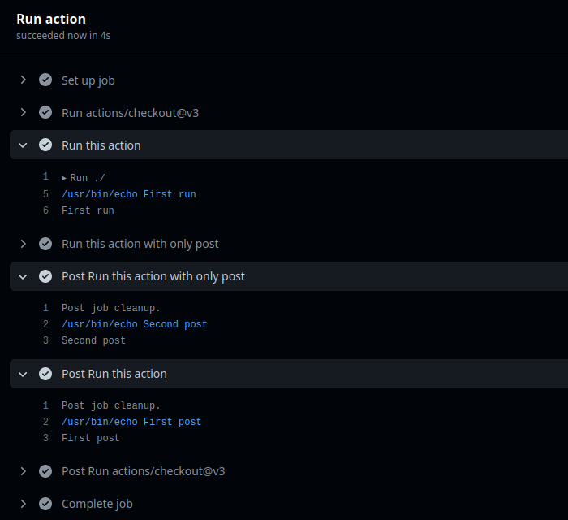

# Run and post run Action

![Release version][badge_release_version]
[![Build Status][badge_build]][link_build]
[![License][badge_license]][link_license]

A simple GitHub action that allows you to execute commands on place and in post-run, once a workflow job has ended.

[Linked GitHub issue][community_issue].

## Usage

```yaml
jobs:
  run-some-action:
    name: Run action
    runs-on: ubuntu-20.04
    steps:
      - uses: actions/checkout@v3

      - name: Run this action
        uses: gacts/run-and-post-run@v1
        with:
          run: echo "First"
              "(can be multiline)"
          post: |
            echo "First post"
            echo "(can run multiply commands)"
            ls -la /tmp \
              /bin /opt

      - name: Run this action with only post
        uses: gacts/run-and-post-run@v1
        with:
          post: echo "Second post"

```

This above configuration will produce the following:



### Customizing

#### Inputs

Following inputs can be used as `step.with` keys:

| Name                |        Type        | Default | Required | Description                                                                 |
|---------------------|:------------------:|:-------:|:--------:|-----------------------------------------------------------------------------|
| `run`               | `string` or `list` |         |    no    | A commands that needs to be run in place.                                   |
| `post`              | `string` or `list` |         |   yes    | A commands that needs to be run once a workflow job has ended.              |
| `working-directory` |      `string`      |         |    no    | A working directory from which the command needs to be run.                 |
| `shell`             |      `string`      | `bash`  |    no    | A shell to use for executing `run` commands.                                |
| `post-shell`        |      `string`      |         |    no    | A shell to use for executing `post` commands. Defaults to value of `shell`. |

## Releasing

New versions releasing scenario:

- Make required changes in the [changelog](CHANGELOG.md) file
- Build the action distribution (`make build` or `yarn build`)
- Commit and push changes (including `dist` directory changes - this is important) into the `main` branch
- Publish new release using repo releases page (git tag should follow `vX.Y.Z` format)

Major and minor git tags (`v1` and `v1.2` if you publish `v1.2.Z` release) will be updated automatically.

## Support

[![Issues][badge_issues]][link_issues]
[![Issues][badge_pulls]][link_pulls]

If you find any action errors, please, [make an issue][link_create_issue] in the current repository.

## License

This is open-sourced software licensed under the [MIT License][link_license].

[badge_build]:https://img.shields.io/github/actions/workflow/status/gacts/run-and-post-run/tests.yml?branch=main&maxAge=30
[badge_release_version]:https://img.shields.io/github/release/gacts/run-and-post-run.svg?maxAge=30
[badge_license]:https://img.shields.io/github/license/gacts/run-and-post-run.svg?longCache=true
[badge_release_date]:https://img.shields.io/github/release-date/gacts/run-and-post-run.svg?maxAge=180
[badge_commits_since_release]:https://img.shields.io/github/commits-since/gacts/run-and-post-run/latest.svg?maxAge=45
[badge_issues]:https://img.shields.io/github/issues/gacts/run-and-post-run.svg?maxAge=45
[badge_pulls]:https://img.shields.io/github/issues-pr/gacts/run-and-post-run.svg?maxAge=45

[link_build]:https://github.com/gacts/run-and-post-run/actions
[link_license]:https://github.com/gacts/run-and-post-run/blob/main/LICENSE
[link_issues]:https://github.com/gacts/run-and-post-run/issues
[link_create_issue]:https://github.com/gacts/run-and-post-run/issues/new
[link_pulls]:https://github.com/gacts/run-and-post-run/pulls

[community_issue]:https://github.com/orgs/community/discussions/26743
